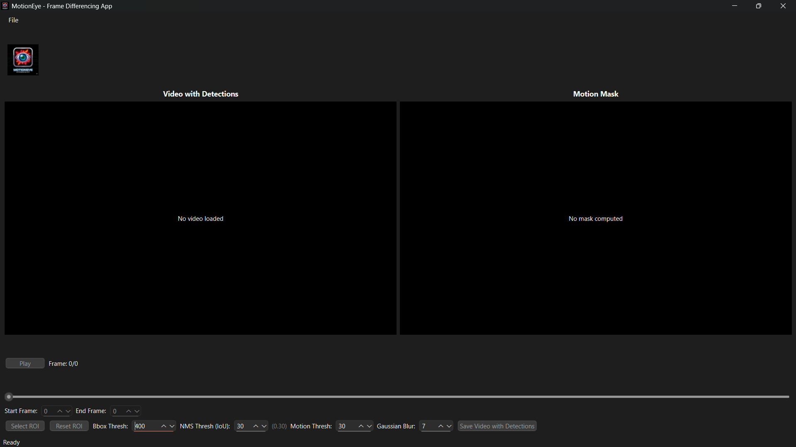
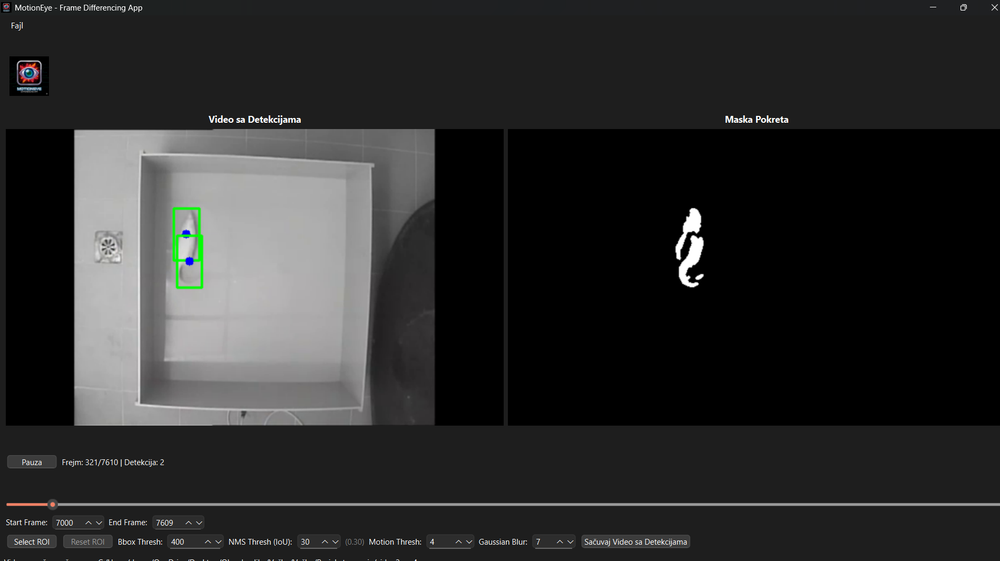
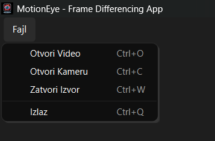
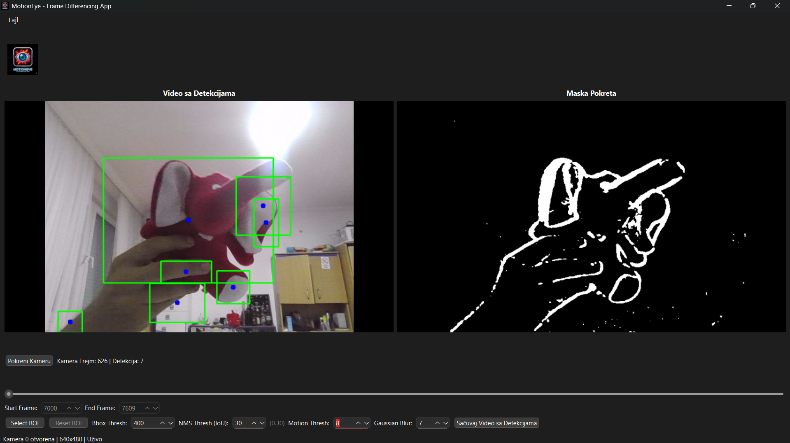
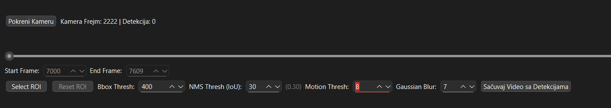

# MotionEye - Student Motion Detection App

MotionEye is a PyQt6 desktop app for detecting motion in video files using frame differencing. It is a student project that runs on the CPU and does not use deep learning.

## Features

- Frame differencing motion detection
- Region of Interest (ROI) selection
- Adjustable parameters:
  - Bounding box threshold (object size filter)
  - NMS threshold (suppression of overlapping boxes)
  - Motion threshold (sensitivity)
  - Gaussian blur (noise reduction)
- Save video with bounding boxes
- Optional live camera preview

## Screenshots

- **Main Window**



- **Video Loaded**



- **File Menu (Open Video)**



- **Detection In Progress (Camera)**




- **Parameter Bar**



## Quick Start

### Prerequisites

- Python 3.8 or newer
- pip (Python package manager)

### Installation

1. **Clone or download the repository**

2. **Create and activate virtual environment** (recommended):
   ```bash
   python -m venv venv
   ```
   
   Activate:
   - **Windows**: `venv\Scripts\activate`
   - **Linux/Mac**: `source venv/bin/activate`

3. **Install dependencies**:
   ```bash
   pip install -r requirements.txt
   ```

### Running the Application

```bash
python main.py
```

Alternative command:
```bash
python -m motioneye.ui.main_window
```

## Usage

### Opening a Video File
1. Click **File** → **Open Video** (or press `Ctrl+O`)
2. Select a video file (supports: .mp4, .avi, .mov, .mkv)

### Detection Controls
- **Play/Pause**: Play video with real-time motion detection
- **Frame Slider**: Navigate through video frames
- **Start/End Frame**: Set analysis range

### Detection Parameters
- **Bbox Thresh**: Minimum detected object size (100-10000 pixels)
- **NMS Thresh**: Suppression intensity for overlapping boxes (0.01-0.90)
- **Motion Thresh**: Motion sensitivity (1-255, lower = more sensitive)
- **Gaussian Blur**: Smoothing filter size (1-31, odd values only)

### Region of Interest (ROI)
1. Click **Select ROI** button
2. Draw a rectangle on the video frame to define detection area
3. Click **Reset ROI** to remove the selection

### Saving Results
1. Click **Save Video with Detections**
2. Choose output location and filename
3. Wait for processing to complete

## Project Structure

```
MotionEye/
├── main.py                      # Application entry point
├── README.md                    # This file
├── requirements.txt             # Python dependencies
├── .gitignore                   # Git ignore rules
│
├── motioneye/                   # Main package
│   ├── __init__.py
│   ├── assets/                  # Application assets
│   │   └── logo.png            # Application logo
│   │
│   ├── core/                    # Detection algorithms
│   │   ├── __init__.py
│   │   └── detection.py        # Motion detection core
│   │
│   └── ui/                      # User interface
│       ├── __init__.py
│       └── main_window.py      # Main GUI window
│
└── data/                        # Optional: sample videos
    └── samples/                 # Place sample videos here
```

## Technical Details

### Frame Differencing Algorithm

Steps used in detection:

1. Frame subtraction: absolute difference between consecutive frames
2. Gaussian blur: smoothing to reduce noise
3. Thresholding: binary mask from motion pixels
4. Contour detection: find connected regions
5. Bounding boxes: rectangles around moving objects
6. NMS: remove overlapping detections

### Advantages
- Fast on CPU
- No GPU required
- No model training
- Low memory use

### Limitations
- Sensitive to camera movement and lighting changes
- Works best with a stationary camera
- Parameter tuning depends on the scene

## Technologies Used

- **PyQt6**: GUI framework
- **OpenCV**: Video and image processing
- **NumPy**: Numerical computations

## Camera Support

Camera functionality is experimental and may have issues:
- Limited to live preview
- No recording support
- Less stable than video file mode
- Recommended to use video files for stable operation

## Troubleshooting

| Issue | Solution |
|-------|----------|
| No detections | Increase motion sensitivity, adjust Gaussian blur |
| Too many false positives | Increase motion threshold, increase bbox threshold |


---

Tips: Start with default parameters and adjust for your video.

